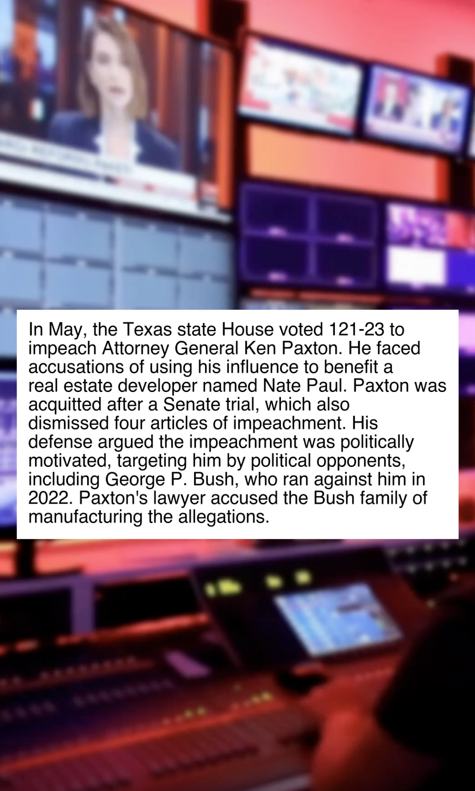

# Pipeline

This project was conceived as a PoC for a content pipeline that given a bunch of news,
summarizes them and creates a short video with stock footages and a TTS speech model.

## Installation

To get started with Pipeline, you need to have [Poetry](https://python-poetry.org/) installed. Once you have Poetry installed, follow these steps:

1. Clone this repository to your local machine:

   ```shell
   git clone https://github.com/jmg-duarte/pipeline.git
   ```

2. Navigate to the project directory:

   ```shell
   cd pipeline
   ```

3. Use Poetry to install the project dependencies:

   ```shell
   poetry install
   ```

## Usage



To use Pipeline, you'll need a ChatGPT API key from OpenAI. If you don't have one,
sign up for an account on the [OpenAI website](https://www.openai.com/) and create an API key.

Once you have your API key, you can run Pipeline by setting it as an environment variable:

```shell
export OPENAI_API_KEY="your-api-key-here"
```

It is split into several tools and the _current process is manual_.

Inside the `video/` folder there is the main video creation script which given an audio file,
some text and the background video, will composite them into a video that roughly looks as shown on the right.

<!-- ## License

This project is licensed under the MIT License - see the [LICENSE](LICENSE) file for details. -->
